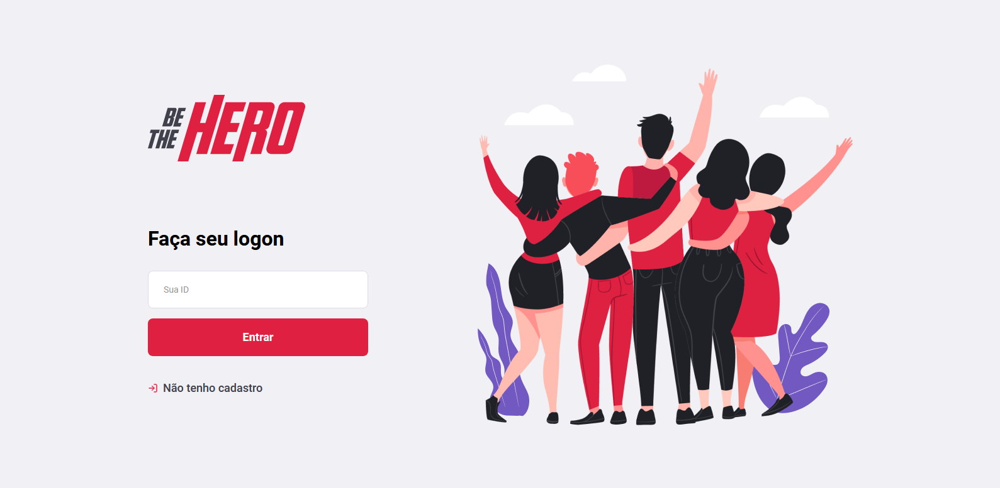

# Projeto: Be the Hero

Um site para cadastrar ONGs

### Utilidade:

- Aplicação frontend em React usada como aprendizado.

#### Principais Materiais:

- React
- Npm
- NodeJs

#### Pré-requisitos

Antes de usar a aplicação, é ideal que você tenha o ambiente [Be-the-hero-backend](https://github.com/RobMota/Be-the-hero-backend) configurado.

#### Modo de uso:

1. Abra um terminal ( cmd/propt de comando )
2. Clone o repositório ( git clone git@github.com:RobMota/Be-the-hero-frontend.git ) em algum local de preferência
3. Acesse a pasta ( cd Be-the-hero-frontend)
4. E digite os comandos abaixo:

- `npm install`
- `npm start`
